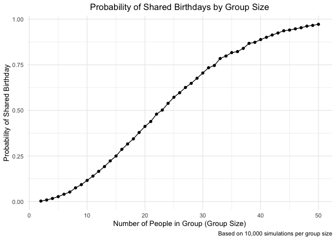
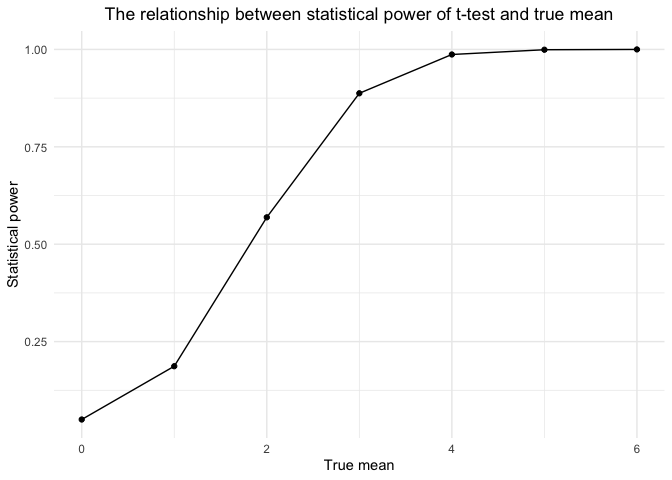
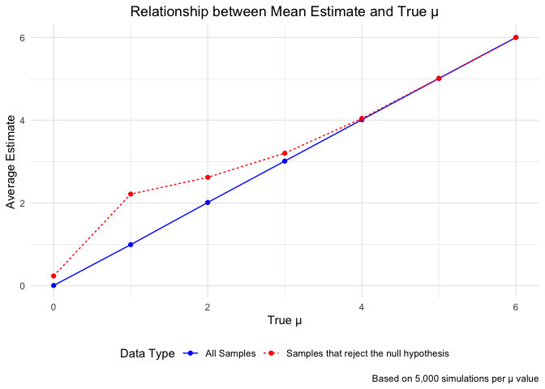
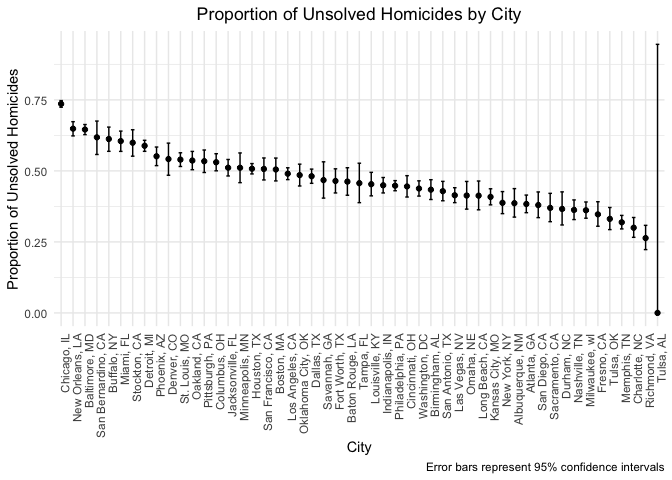

p8105_hw5_jz3900
================
ELisajava
2024-11-11

# Import necessary libraries

``` r
library(tidyverse) 
```

    ## ── Attaching core tidyverse packages ──────────────────────── tidyverse 2.0.0 ──
    ## ✔ dplyr     1.1.4     ✔ readr     2.1.5
    ## ✔ forcats   1.0.0     ✔ stringr   1.5.1
    ## ✔ ggplot2   3.5.1     ✔ tibble    3.2.1
    ## ✔ lubridate 1.9.3     ✔ tidyr     1.3.1
    ## ✔ purrr     1.0.2     
    ## ── Conflicts ────────────────────────────────────────── tidyverse_conflicts() ──
    ## ✖ dplyr::filter() masks stats::filter()
    ## ✖ dplyr::lag()    masks stats::lag()
    ## ℹ Use the conflicted package (<http://conflicted.r-lib.org/>) to force all conflicts to become errors

``` r
library(broom)
library(ggplot2)
set.seed(1)
```

# Problem 1

``` r
# Define a function to check for duplicate birthdays in a group
check_duplicate_birthday <- function(n) {
  sampled_birthdays <- sample(1:365, n, replace = TRUE)  # Generate sample birthdays randomly
  any(duplicated(sampled_birthdays))  # Return TRUE if duplicates are found
}

# Set up group sizes and initialize a vector for storing probabilities
group_sizes <- 2:50
probabilities <- numeric(length(group_sizes))

# Simulate the probability of duplicated birthdays for each group size
probabilities <- sapply(group_sizes, function(n) {
  mean(replicate(10000, check_duplicate_birthday(n)))
})

# Prepare data for visualization
results_data <- data.frame(GroupSize = group_sizes, Probability = probabilities)

# Generate the plot
ggplot(results_data, aes(x = GroupSize, y = Probability)) +
  geom_line() +
  geom_point() +
  labs(
    title = "Probability of Shared Birthdays by Group Size",
    x = "Number of People in Group (Group Size)",
    y = "Probability of Shared Birthday",
    caption = "Based on 10,000 simulations per group size"
  ) +
  theme_minimal() +
  theme(plot.title = element_text(hjust = 0.5))
```

<!-- -->

The plot illustrates that as the group size grows, the likelihood of at
least two people sharing a birthday rises sharply. With just 23 people
in a group, the probability surpasses 50%. As the group size nears 50,
the probability approaches certainty 1.00.

# Problem 2

## Define parameters and create datasets

``` r
# Define parameters
params <- list(
  sample_size = 30,
  sample_var = 5,
  mu_values = seq(0, 6, by = 1),
  alpha = 0.05,
  n_sim = 5000
)

# Function to simulate data and perform t-tests
simulate_t_test <- function(n, mu, sigma) {
  results <- replicate(params$n_sim, { 
    x <- rnorm(n, mean = mu, sd = sigma)  # Generate random data
    test <- t.test(x, mu = 0)  # Perform t-test
    tidy_result <- tidy(test)  # Extract estimate and p-value
    list(estimate = tidy_result$estimate, p_value = tidy_result$p.value)
  }, simplify = FALSE)
  
  # Convert list to data frame
  data.frame(
    estimate = sapply(results, `[[`, "estimate"),
    p_value = sapply(results, `[[`, "p_value")
  )
}
```

## Simulation for each value of ‘mu’

``` r
# Run simulations for each value of mu and combine the results
simulation_results <- lapply(params$mu_values, function(mu) {
  simulate_t_test(params$sample_size, mu, params$sample_var)
})
names(simulation_results) <- as.character(params$mu_values)

# Merge all results into one data frame 
simulation_data <- bind_rows(simulation_results, .id = "mu") %>%
  mutate(mu = as.numeric(mu))

# Calculate the statistical power for each mean value 
power_data <- simulation_data %>%
  group_by(mu) %>%
  summarize(power = mean(p_value < params$alpha))

# Draw a statistical power graph
ggplot(power_data, aes(x = mu, y = power)) +
  geom_line() +
  geom_point() +
  labs(
    title = "The relationship between statistical power of t-test and true mean",
    x = "True mean", y = "Statistical power"
  ) +
  theme_minimal() + 
  theme(plot.title = element_text(hjust = 0.5))
```

<!-- -->

``` r
# Calculate the average estimate for all samples
avg_estimate_data <- simulation_data %>%
  group_by(mu) %>%
  summarize(average_estimate = mean(estimate))

# Average estimate when only the null hypothesis is rejected
rejected_estimate_data <- simulation_data %>%
  filter(p_value < params$alpha) %>%
  group_by(mu) %>%
  summarize(average_estimate_rejected = mean(estimate))
```

The plot demonstrates a positive correlation between effect size (true
mean, μ) and statistical power. As the effect size increases, the
statistical power rises, indicating that the t-test becomes more
effective at identifying true effects with larger effect sizes, thereby
enhancing its reliability.

At smaller effect sizes (e.g., μ = 0, 1, 2), the power remains
relatively low, reflecting a reduced likelihood of detecting a true
effect. However, as μ increases to values such as 4, 5, or 6, the power
nears 1, signifying that the test becomes almost certain to detect the
true effect.

## Create estimates plot

``` r
# Combine data for plotting
avg_estimate_data$type <- "All Samples"
rejected_estimate_data$type <- "Samples that reject the null hypothesis"

combined_estimate_data <- bind_rows(
  avg_estimate_data %>% rename(average = average_estimate),
  rejected_estimate_data %>% rename(average = average_estimate_rejected)
)

# Plot the average estimate
ggplot(combined_estimate_data, aes(x = mu, y = average, color = type, linetype = type)) +
  geom_line() +
  geom_point() +
  scale_color_manual(values = c("blue", "red")) +
  labs(
    title = "Relationship between Mean Estimate and True μ",
    x = "True μ",
    y = "Average Estimate",
    color = "Data Type",
    linetype = "Data Type",
    caption = "Based on 5,000 simulations per μ value"
  ) +
  theme_minimal() +
  theme(
    plot.title = element_text(hjust = 0.5),
    legend.position = "bottom"
  )
```

<!-- -->

The plot presents two sets of average estimates corresponding to
different true means (μ):

- **Blue Line (All Samples):** This represents the average estimate of μ
  across all samples, regardless of whether the null hypothesis was
  rejected.  
- **Red Line (Samples that reject the null hypothesis):** This depicts
  the average estimate of μ exclusively for samples where the null
  hypothesis was rejected.

The red line consistently lies above the blue line, particularly for
lower values of μ. This suggests that the average estimate of μ for
tests resulting in rejection of the null hypothesis tends to
overestimate the true mean.

Notably, the sample average of μ-hat for tests where the null is
rejected does not accurately reflect the true value of μ; instead, it is
systematically higher. This phenomenon arises due to selection bias,
where samples with stronger observed effects (i.e., larger estimates)
are more likely to result in rejection of the null hypothesis.

# Problem 3

## Import dataset and read data

``` r
homicides <- read_csv("./data/homicide-data.csv", show_col_types = FALSE)
```

The dataset contains information on homicide incidents across major U.S.
cities, with each row detailing a specific case. Below is a summary of
the key variables:  
- **reported_date**: Numeric - The date the homicide was reported,
recorded as an integer in the format YYYYMMDD.  
- **victim_last**: String - The victim’s last name.  
- **victim_first**: String - The victim’s first name.  
- **victim_race**: String - The victim’s race (e.g., Hispanic, White,
Black, Other).  
- **victim_age**: String - The victim’s age, with some entries labeled
as “Unknown.”  
- **victim_sex**: String - The victim’s gender (e.g., Male, Female).  
- **city**: String - The city where the incident occurred.  
- **state**: String - The state abbreviation where the incident took
place.  
- **disposition**: String - The case status, such as “Closed without
arrest,” “Open/No arrest,” or “Closed by arrest.”

``` r
# Create a new variable city_state
homicides <- homicides %>%
  mutate(city_state = str_c(city, ", ", state))  # Using str_c for concatenation

# Generate a summary: total homicides and unsolved cases
city_summary <- homicides %>%
  group_by(city_state) %>%
  summarize(
    total_homicides = n(),
    unsolved_homicides = sum(disposition %in% c("Closed without arrest", "Open/No arrest")),
    .groups = "drop"  # Explicitly drop grouping for clarity
  )

city_summary
```

    ## # A tibble: 51 × 3
    ##    city_state      total_homicides unsolved_homicides
    ##    <chr>                     <int>              <int>
    ##  1 Albuquerque, NM             378                146
    ##  2 Atlanta, GA                 973                373
    ##  3 Baltimore, MD              2827               1825
    ##  4 Baton Rouge, LA             424                196
    ##  5 Birmingham, AL              800                347
    ##  6 Boston, MA                  614                310
    ##  7 Buffalo, NY                 521                319
    ##  8 Charlotte, NC               687                206
    ##  9 Chicago, IL                5535               4073
    ## 10 Cincinnati, OH              694                309
    ## # ℹ 41 more rows

## Analyzing and Visualizing Unsolved Homicide Proportions Across U.S. Cities

``` r
# Filter for Baltimore, MD
baltimore_data <- city_summary %>% filter(city_state == "Baltimore, MD")

# Run prop.test
baltimore_test <- prop.test(
  x = baltimore_data %>% pull(unsolved_homicides), 
  n = baltimore_data %>% pull(total_homicides)
)

# Apply the broom::tidy
baltimore_tidy <- broom::tidy(baltimore_test) 

# Extract the estimated proportion and confidence intervals
baltimore_proportion <- baltimore_tidy %>% select(estimate, conf.low, conf.high)
```

The proportion of unsolved homicides estimated for Baltimore, MD, is
0.6455607. This estimate is accompanied by a 95% confidence interval
ranging from 0.6275625 to 0.6631599.

``` r
# Use prop.test for each city and extract the results
city_results <- city_summary %>%
  mutate(
    test_results = map2(
      unsolved_homicides, total_homicides,
      ~ prop.test(x = .x, n = .y) %>% tidy()
    )
  ) %>%
  unnest(test_results) %>%
  select(city_state, estimate, conf.low, conf.high)
```

## Plot the estimates and CIs for each city.

``` r
# Organize cities by the proportion of unsolved homicides
city_results <- city_results %>%
  arrange(desc(estimate)) %>%
  mutate(city_state = factor(city_state, levels = city_state))

# Create the plot
ggplot(city_results, aes(x = city_state, y = estimate)) +
  geom_point() +
  geom_errorbar(aes(ymin = conf.low, ymax = conf.high), width = 0.3) +
  labs(
    title = "Proportion of Unsolved Homicides by City",
    x = "City",
    y = "Proportion of Unsolved Homicides",
    caption = "Error bars represent 95% confidence intervals"
  ) +
  theme_minimal() +
  theme(axis.text.x = element_text(angle = 90, hjust = 1), 
        plot.title = element_text(hjust = 0.5))
```

<!-- -->

The chart illustrates the proportion of unsolved homicides across
cities, arranged in descending order. Cities such as Chicago, New
Orleans, and Baltimore exhibit the highest proportions, approximately
75%, whereas cities like Tulsa, AL have significantly lower proportions.
The error bars depict the confidence intervals, with wider bars
reflecting greater uncertainty in the estimates. The data highlights
notable differences in case resolution rates among cities.
